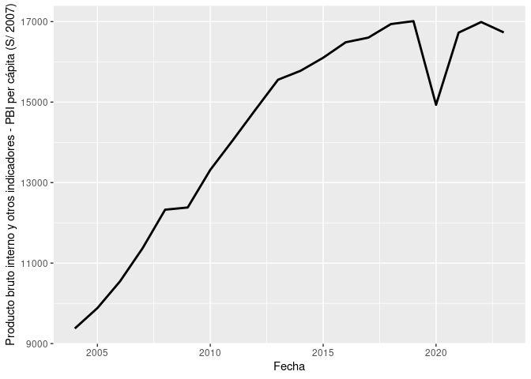

<!-- README.md is generated from README.Rmd. Please edit that file -->

# bcR

`bcR` te permite conseguir datos directamente desde el API del BCRP.
Eliminando la necesidad de descargar los datos manualmente.

## Instalación

El paquete está disponible únicamente, por el momento, por GitHub.
Puedes instalarlo de la siguiente manera:

``` r
devtools::install_github("https://github.com/Amaru6/bcR")
#> Downloading GitHub repo Amaru6/bcR@HEAD
#> openssl (2.1.2 -> 2.2.0) [CRAN]
#> Installing 1 packages: openssl
#> Installing package into '/home/julio/R/x86_64-pc-linux-gnu-library/4.3'
#> (as 'lib' is unspecified)
#> ── R CMD build ─────────────────────────────────────────────────────────────────
#>      checking for file ‘/tmp/RtmpAJe8y0/remotes39c44a367706/Amaru6-bcR-f867318/DESCRIPTION’ ...  ✔  checking for file ‘/tmp/RtmpAJe8y0/remotes39c44a367706/Amaru6-bcR-f867318/DESCRIPTION’
#>   ─  preparing ‘bcR’:
#>    checking DESCRIPTION meta-information ...  ✔  checking DESCRIPTION meta-information
#>   ─  checking for LF line-endings in source and make files and shell scripts
#>   ─  checking for empty or unneeded directories
#>   ─  building ‘bcR_0.1.tar.gz’
#>      
#> 
#> Installing package into '/home/julio/R/x86_64-pc-linux-gnu-library/4.3'
#> (as 'lib' is unspecified)
```

## Ejemplo

``` r
library(bcR)
library(tidyverse)
#> ── Attaching core tidyverse packages ──────────────────────── tidyverse 2.0.0 ──
#> ✔ dplyr     1.1.4     ✔ readr     2.1.5
#> ✔ forcats   1.0.0     ✔ stringr   1.5.1
#> ✔ ggplot2   3.5.1     ✔ tibble    3.2.1
#> ✔ lubridate 1.9.3     ✔ tidyr     1.3.1
#> ✔ purrr     1.0.2     
#> ── Conflicts ────────────────────────────────────────── tidyverse_conflicts() ──
#> ✖ dplyr::filter() masks stats::filter()
#> ✖ dplyr::lag()    masks stats::lag()
#> ℹ Use the conflicted package (<http://conflicted.r-lib.org/>) to force all conflicts to become errors
consultar_bcrp_api(
  codigos = c("PM04862AA") # Si no se incluye el rango de fechas, se extraerá las fechas más recientes.
) -> datos_consultados

datos_consultados # Esta es la respuesta de la API, sobre la cual podemos trabajar 
#> # A tibble: 20 × 2
#>    Fecha `Producto bruto interno y otros indicadores - PBI per cápita (S/ 2007)`
#>    <int> <chr>                                                                  
#>  1  2004 9376,1                                                                 
#>  2  2005 9882,7                                                                 
#>  3  2006 10545,9                                                                
#>  4  2007 11368,0                                                                
#>  5  2008 12327,4                                                                
#>  6  2009 12381,6                                                                
#>  7  2010 13316,2                                                                
#>  8  2011 14054,5                                                                
#>  9  2012 14811,1                                                                
#> 10  2013 15556,0                                                                
#> 11  2014 15778,7                                                                
#> 12  2015 16102,6                                                                
#> 13  2016 16487,0                                                                
#> 14  2017 16601,5                                                                
#> 15  2018 16938,8                                                                
#> 16  2019 17011,6                                                                
#> 17  2020 14932,6                                                                
#> 18  2021 16726,3                                                                
#> 19  2022 16989,4                                                                
#> 20  2023 16730,8

datos_consultados |> 
  mutate(
    `Producto bruto interno y otros indicadores - PBI per cápita (S/ 2007)` = `Producto bruto interno y otros indicadores - PBI per cápita (S/ 2007)` |> 
      str_replace("\\,", "\\.") |> as.numeric()
  ) |> 
  ggplot(aes(x = Fecha,
             y = `Producto bruto interno y otros indicadores - PBI per cápita (S/ 2007)`)) + 
  geom_line(linewidth = 1)
```


